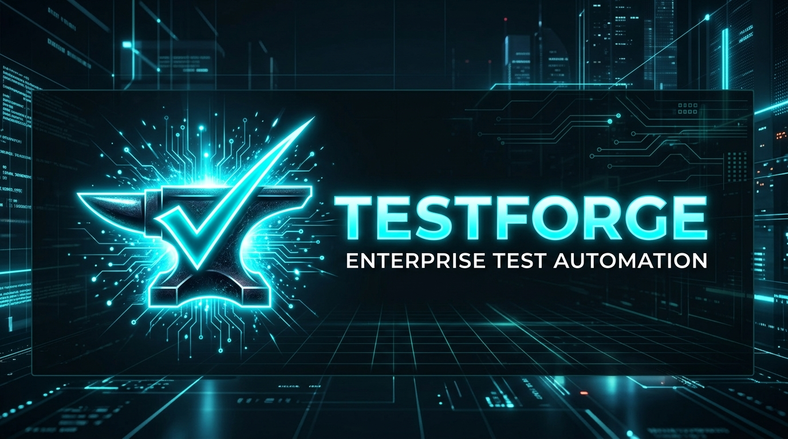
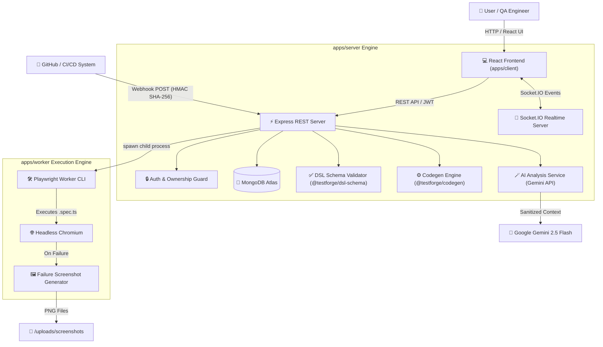
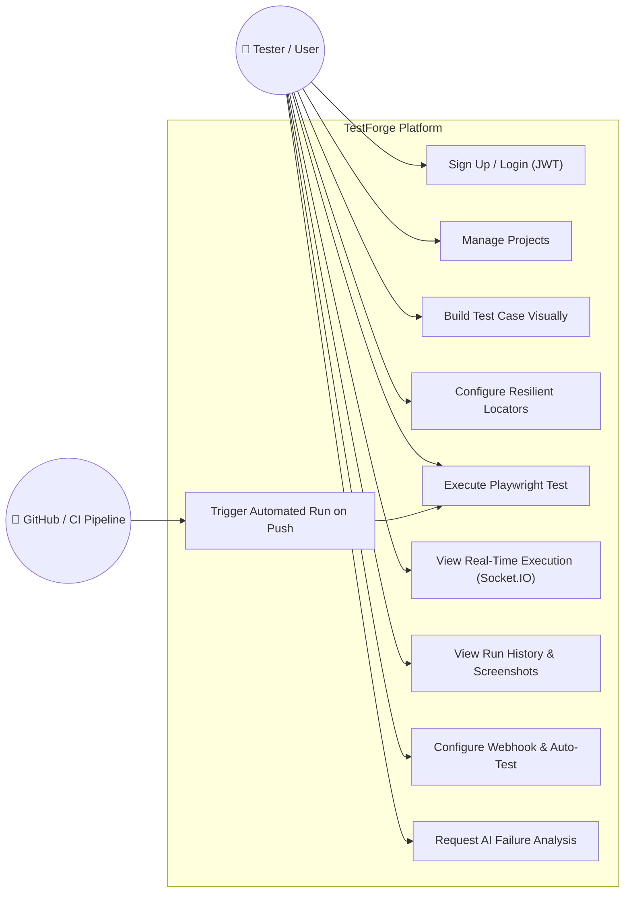
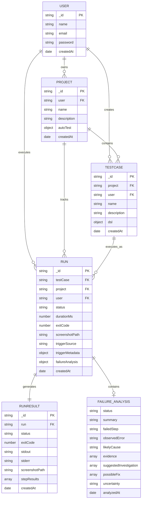

<p align="center">
  
</p>

<p align="center">
  <strong>An Enterprise No-Code Web Test Automation & AI Diagnosis Platform</strong>
</p>

<p align="center">
  <a href="https://nodejs.org/"></a>
  <a href="https://www.typescriptlang.org/"></a>
  <a href="https://react.dev/"></a>
  <a href="https://playwright.dev/"></a>
  <a href="https://expressjs.com/"></a>
  <a href="https://www.mongodb.com/"></a>
  <a href="https://socket.io/"></a>
  <a href="https://ai.google.dev/"></a>
  <a href="#-testing--build-verification"></a>
  <a href="LICENSE"></a>
</p>

---

## 📌 Executive Summary

**TestForge** is an end-to-end visual web test automation platform built for software development teams, QA engineers, and product managers. It enables users to construct, maintain, execute, and troubleshoot automated browser tests visually—**without writing manual Playwright code**.

TestForge converts visual test workflows into a structured JSON Domain Specific Language (**DSL**), compiles the DSL into production-ready Playwright TypeScript (`.spec.ts`) scripts, executes tests in headless **Chromium** worker processes, streams live execution events via **Socket.IO**, triggers automated test suites on **GitHub code pushes**, and diagnoses failures using **Google Gemini AI**.

---

## 📋 Functional & Non-Functional Requirements

### ⚙️ Functional Requirements

1. **User Authentication & Authorization**:
   - Secure JWT-based user registration, login, and session management.
   - Resource ownership checks ensuring users access only their own projects, test cases, execution runs, screenshots, and AI analyses.

2. **Visual Test Builder & DSL Engine**:
   - Visual drag-and-drop canvas supporting 7 action step types: `Navigate`, `Click`, `Fill`, `Assert Visible`, `Assert Text`, `Wait`, and `Screenshot`.
   - Property inspector for configuring target locators (`role`, `text`, `css`) and fallback locators.
   - Step reordering, duplication, parameter editing, deletion, and real-time schema validation.

3. **Playwright Code Generation**:
   - Automated conversion of visual Test DSL JSON into valid, executable Playwright TypeScript (`.spec.ts`) scripts.
   - Parameter interpolation (`{{BASE_URL}}`), character escaping, and locator strategy generation.

4. **Isolated Test Execution Worker**:
   - Asynchronous worker process spawning executing tests in headless Chromium.
   - Stdout/Stderr log capture, execution duration tracking, and exit code handling.

5. **Real-Time Event Streaming**:
   - Socket.IO WebSockets streaming execution state transitions (`QUEUED`, `RUNNING`, `STEP_STARTED`, `STEP_PASSED`, `STEP_FAILED`, `PASSED`, `FAILED`).

6. **Failure Screenshot Capture**:
   - Captures high-resolution PNG screenshots upon step assertion failures or timeouts and serves them statically via secure routes.

7. **CI/CD & Webhook Automation**:
   - HMAC-SHA256 signed GitHub webhooks (`X-Hub-Signature-256`) triggering automated runs on code push events.
   - Generic token-based webhook triggers for external CI/CD pipelines (Jenkins, GitLab, CircleCI).
   - Monitored branch filtering (`main`, `develop`) and idempotent delivery deduplication (`X-GitHub-Delivery`).

8. **AI Failure Analysis**:
   - On-demand AI diagnosis using Google Gemini (`gemini-2.5-flash`) explaining failures, failed step index, observed errors, likely technical causes, evidence, investigation steps, and suggested fixes.
   - Automated secret redaction masking passwords, JWTs, Bearer headers, API keys, and database tokens prior to AI transmission.

9. **Auto-Test Dashboard & Metrics**:
   - Aggregate metrics powered by real MongoDB data (`Total Projects`, `Test Cases`, `Total Runs`, `Pass Rate %`, `Automatic Runs`, `Auto Pass Rate %`).
   - Project filter dropdown and execution trigger tabs (`All`, `Manual`, `Automatic`, `GitHub`).

---

### 🛡️ Non-Functional Requirements

1. **Security**:
   - Server-side isolation of `GEMINI_API_KEY` (never exposed to client bundles).
   - Zero-trust secret masking (`<REDACTED>`) on all outbound AI payloads.
   - Timing-safe HMAC SHA-256 webhook signature verification (`crypto.timingSafeEqual`).
   - Path traversal prevention for screenshot static file serving.
   - Secure child process execution via `spawn` with argument arrays (no `shell: true`).

2. **Performance**:
   - Sub-100ms Socket.IO WebSocket latency for live execution step updates.
   - Fast REST API response times (<50ms for DB queries with indexing).
   - Non-blocking asynchronous worker process spawning.

3. **Reliability & Resilience**:
   - Multi-tier locator fallbacks (`role` ➜ `text` ➜ `css`) preventing test flakiness.
   - Worker crash isolation ensuring backend server stability if browser execution fails.

4. **Usability & Responsiveness**:
   - Responsive UI supporting Desktop (1440px), Laptop (1280px), Tablet (768px), and Mobile (390px).
   - Inline skeleton loaders, user-friendly error alerts, and contextual empty states.

---

## 🏛️ System Architecture



---

## 🎭 Use Case Diagram



---

## 🗄️ Entity-Relationship (ER) Diagram



---

## 🧩 Module Description

### 1. Frontend Module (`apps/client`)

- **Visual Test Builder (`TestCaseDetailPage.tsx`)**: Visual drag-and-drop builder canvas for constructing test step sequences with real-time property editing.
- **Dashboard (`DashboardPage.tsx`)**: Real-time aggregate metric overview cards (`Total Projects`, `Test Cases`, `Total Runs`, `Pass Rate %`, `Auto Runs`, `Auto Pass Rate %`), project dropdown filter, and trigger tab views.
- **Run History & Detail Modal (`RunHistory.tsx`, `RunDetailModal.tsx`)**: History table sorted newest first, showing step breakdown, durations, console logs, failure screenshots, and AI analysis card.
- **Project Detail (`ProjectDetailPage.tsx`)**: Project overview, test case listing, environment management, and Webhook Auto-Test configuration UI.

### 2. Server Module (`apps/server`)

- **Authentication & Controllers**: User registration, JWT login (`auth.controller.js`), project CRUD (`project.controller.js`), test case CRUD (`testcase.controller.js`), execution management (`run.controller.js`), and webhook handlers (`webhook.controller.js`).
- **Execution Service (`execution.service.js`)**: Spawns Playwright worker processes, manages temporary `.spec.ts` files, emits Socket.IO events, records `Run` & `RunResult` MongoDB documents.
- **AI Failure Analysis Service (`aiService.js`)**: Redacts sensitive credentials (`<REDACTED>`), constructs Gemini AI prompts, parses structured JSON diagnoses, and handles provider failures gracefully.
- **Real-Time Socket.IO Server (`socket/index.js`)**: WebSockets server managing run room subscriptions and streaming execution transitions.

### 3. Worker Module (`apps/worker`)

- **Execution CLI (`cli.js`)**: Standalone CLI entrypoint that reads generated Playwright spec files, launches headless Chromium via `@playwright/test`, captures output logs, generates failure PNG screenshots, and returns exit codes.
- **Upload Storage (`uploads/screenshots`)**: Statically served screenshot filesystem directory.

### 4. Shared Packages (`packages/`)

- **DSL Schema Validator (`packages/dsl-schema`)**: Shared JSON schema definition and validator using Ajv for 7 step types and locator strategies.
- **Code Generator Engine (`packages/codegen`)**: Code generation module converting Test DSL JSON into executable Playwright TypeScript code.

---

## 💻 Technology Stack

| Category               | Technology                         | Usage / Purpose                                      |
| :--------------------- | :--------------------------------- | :--------------------------------------------------- |
| **Frontend Framework** | React 18 + Vite                    | Single Page Application framework with HMR           |
| **Language**           | TypeScript 5.0 / JavaScript ES2022 | Strict type safety across client and packages        |
| **Styling & Icons**    | Tailwind CSS + Lucide React        | Modern dark-mode UI styling and icon set             |
| **Backend Runtime**    | Node.js (>= 18.0.0)                | Asynchronous JavaScript backend runtime              |
| **REST Server**        | Express.js 4.19                    | HTTP REST API routing and middleware                 |
| **Database**           | MongoDB Atlas / Mongoose 8         | Document database and ODM modeling                   |
| **Real-Time Engine**   | Socket.IO 4.8                      | WebSockets execution event streaming                 |
| **Test Automation**    | Playwright 1.44                    | Headless Chromium browser automation engine          |
| **AI Diagnosis**       | Google Gemini 2.5 Flash            | Server-side AI failure analysis engine               |
| **Security & Auth**    | JWT + bcryptjs + crypto            | Token authentication, password hashing, HMAC SHA-256 |
| **Workspace Manager**  | npm Workspaces                     | Monorepo package management                          |

---

## 🎨 UI Design & Workflows

### 1. Dashboard View

- **Header & Filter Bar**: Welcome banner with user greeting, project context filter dropdown (`All Projects` or specific project), and `[Refresh]` button.
- **Auto-Test Summary Banner**: Prominently displays selected project Auto-Test configuration (`Enabled`/`Disabled`), provider (`GitHub Webhook` / `Generic Webhook`), target repository, monitored branch, configured test count, and `[Configure Settings]` link.
- **8 Metric Overview Cards**: `Total Projects`, `Test Cases`, `Total Runs`, `Overall Pass Rate %`, `Automatic Runs`, `Auto Pass Rate %`, `Auto Passed`, `Auto Failed`.
- **Recent Executions Table**: Filter tabs (`All`, `Manual`, `Automatic`, `GitHub`) displaying Test Case name, Project, Trigger source & Git branch/commit badges, Status, Duration, Timestamp, and row click opening `RunDetailModal`.

### 2. Visual Test Builder Canvas

- **Action Blocks Palette**: Click or drag to add `Navigate`, `Click`, `Fill`, `Assert Visible`, `Assert Text`, `Wait`, or `Screenshot` steps.
- **Step Property Inspector**: Edit step target locator strategy (`role`, `text`, `css`), value, timeout, and fallback locator properties.
- **Toolbar**: `[ Save Test Case ]`, `[ Run Test ]`, step reordering handles, step duplication, step deletion, and instant DSL validation indicator.

### 3. Run Detail & AI Failure Analysis Modal

- **Execution Overview**: Duration, Exit Code, Started At, Completed At, Trigger Source & Webhook Metadata badges.
- **AI Failure Analysis Card** (Failed Runs Only):
  - `[ 🪄 Analyze Failure ]` action button.
  - **Summary**, **Failed Step**, **Observed Error**, **Likely Technical Cause**, **Evidence** (bulleted list), **Suggested Investigation** (numbered list), **Possible Fix**, and **Uncertainty**.
  - `[ 🔄 Re-analyze ]` button for fresh analysis requests.
- **Step Breakdown List**: Visual step status badges (`✓ Passed` emerald vs `✕ Failed` red), durations, and inline error tracebacks.
- **Failure Screenshot**: Embedded failure screenshot preview with open full-size link.
- **Console Output**: Toggleable STDOUT / STDERR logs terminal viewer.

---

## 🛠️ Setup & Development Guide

### Prerequisites

- **Node.js**: `>= 18.0.0`
- **npm**: `>= 8.0.0`
- **MongoDB**: Local MongoDB instance or MongoDB Atlas Connection URI

### Installation

1. **Clone the Repository:**

   ```bash
   git clone https://github.com/VIJAYAPANDIANT/testforge.git
   cd testforge
   ```

2. **Install Workspace Dependencies:**

   ```bash
   npm run install:all
   ```

3. **Configure Environment Variables:**
   Create `.env` in `apps/server/.env` based on `.env.example`:

   ```ini
   PORT=5000
   NODE_ENV=development
   MONGODB_URI=mongodb://127.0.0.1:27017/testforge
   JWT_SECRET=your_jwt_secret_key_here
   CLIENT_URL=http://localhost:5173
   GEMINI_API_KEY=your_gemini_api_key_here

   VITE_API_URL=http://localhost:5000
   ```

4. **Start Development Servers:**

   ```bash
   # Start backend API server (http://localhost:5000)
   npm run dev:server

   # Start frontend React application (http://localhost:5173)
   npm run dev:client
   ```

---

## 🧪 Testing & Build Verification

TestForge maintains an extensive automated test suite across all monorepo packages:

```bash
# 1. Verify Frontend Production Build
npm run build --workspace=apps/client

# 2. Execute Monorepo Automated Test Suite (117 Unit Tests)
npm test --workspace=packages/dsl-schema --workspace=packages/codegen --workspace=apps/server
```

---

## 📄 License

This project is licensed under the **MIT License** — see the [LICENSE](LICENSE) file for details.
